# Introducing Dark CPI: Enhance Your Application Experience

Welcome to Dark CPI! The Dark SAP CPI Web Extension is a versatile open-source tool that enhances the user interface of SAP CPI and SAP Build Work Zone. It offers a seamless transition to a dark theme, promoting a comfortable visual experience for users. In this guide, we'll show you how to use Dark CPI to get the most out of its features.

## Key Features of Dark CPI

- **Ease of Use:** Users can effortlessly switch to a dark theme, reducing eye strain.
- **Theme Variety:** The extension boasts a range of themes such as 'Morning Horizon', 'Evening Horizon', and 'Quartz Light', allowing users to personalize their interface according to their preference and the time of day.
- **Accessibility:** The dark theme can be activated via a simple click on the extension icon, making it easily accessible for all users.
- **Community Support:** Currently, there are 80+ weekly users. Thank you for the support and feedback given by you all.

## Installation Guide

### Step 1: Download and Install from the Extension Store

1. Go to the Extension Store:
   - [Chrome Store](https://chromewebstore.google.com/detail/dark-sap-cpi/lmegddleeigeddljmdkonofmppbefneo)
   - [EDGE Store](https://microsoftedge.microsoft.com/addons/detail/gpafgeambljleonppfbeieehlmdiffop)
2. Search for Dark CPI.
3. Click on "Add to Browser".
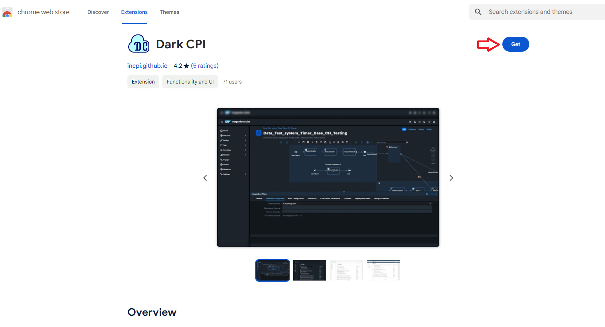
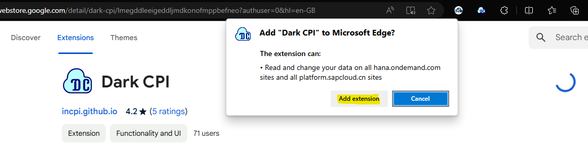

### Step 2: Enable the Extension

After installation, click on the Dark CPI icon in your browser toolbar.
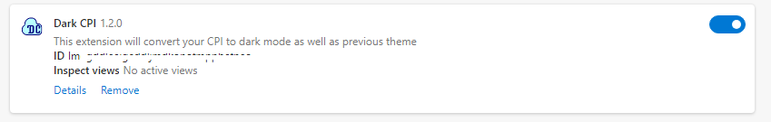

### Alternative Installation from GitHub

1. Visit the [Dark CPI GitHub Repository](https://github.com/incpi/Dark-CPI-Web-Extension)
2. Download the latest release.
3. Unzip the downloaded file.
4. Open your browser and navigate to the extensions page (e.g., `chrome://extensions/`).
5. Enable Developer Mode.
6. Click on "Load unpacked" and select the unzipped folder.

## How to Use Dark CPI

#### Popup on click appears as below under these conditions:
If you click on Extension Icon which is besides URL if extension is pinned or you can pin it by clicking on extension manager of browser.

- If active tab is not supported,
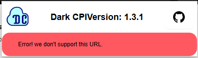

- It supported then you can see the name of application and current theme.

- Launchpad supports theme are displayed in below buttons.
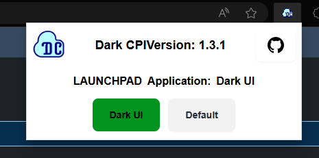

The options available are:
- **Default Theme:** Provided by SAP.
- **Dark UI:** Corresponding dark UI to the default theme.
- **Old UI:** Rollback option (only visual, no functionality change).

### Applying Themes

1. **SAP CPI (from v1.0):**
   - Open the SAP CPI application.
   - Choose your desired theme from the extension popup.
   - This will enhance the SAP UI with the selected dark theme.

   Before Theme:
   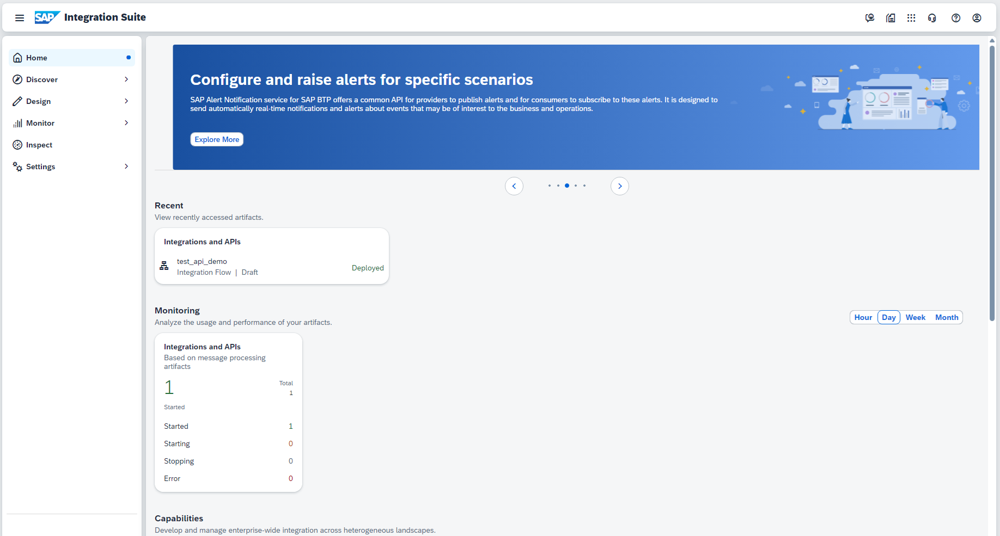

   After Applying Theme:
   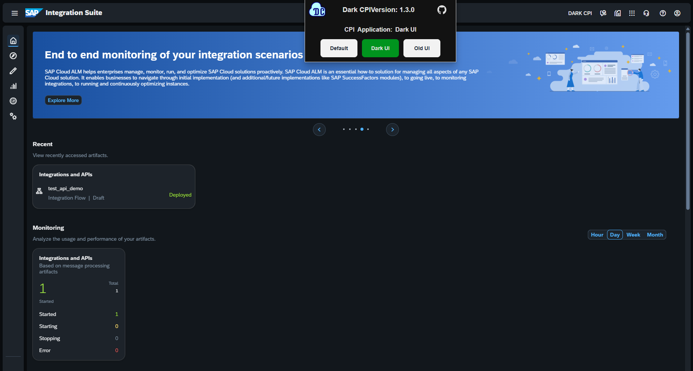
   

   Rollback Theme (Old):
   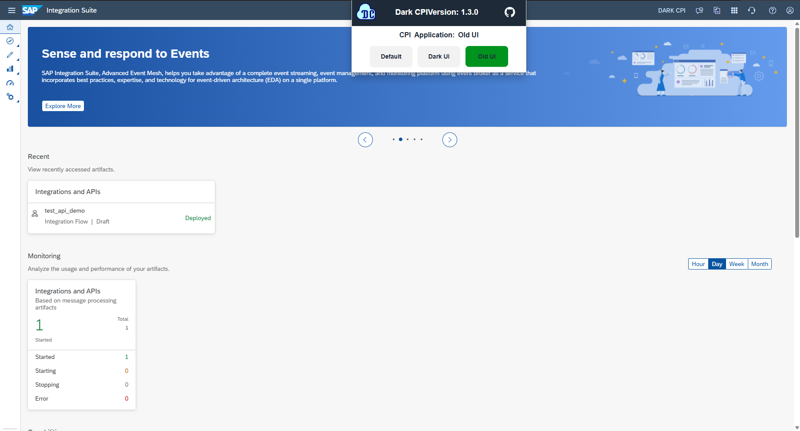

   - By default, the right-side navigation (home, monitor design, etc.) is open. Dark CPI will close it by default to avoid clutter.
   - Navigation Open:
   
   - Navigation Closed:
   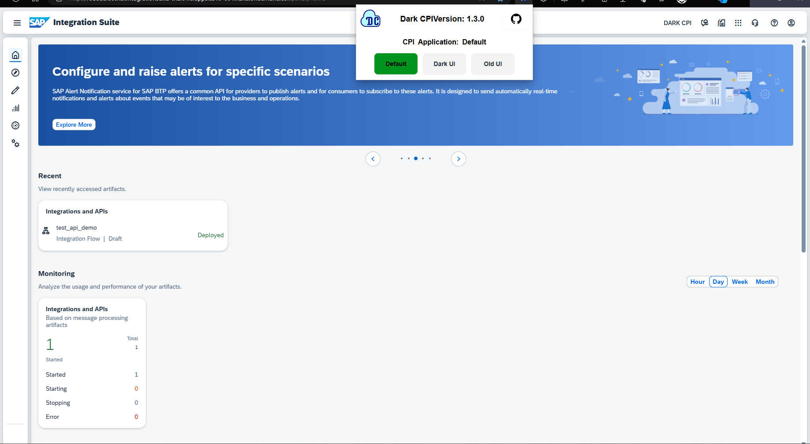

2. **SAP Build Work Zone (from v1.3):**
   - Launch the SAP Build Work Zone application.
   - Select your preferred theme from the extension popup.
   **It has user settings to switch theme. Keep same theme in extension popup.**
   
   As you can see below, SAP does not support dark theme properly. This will enhance its UI.
   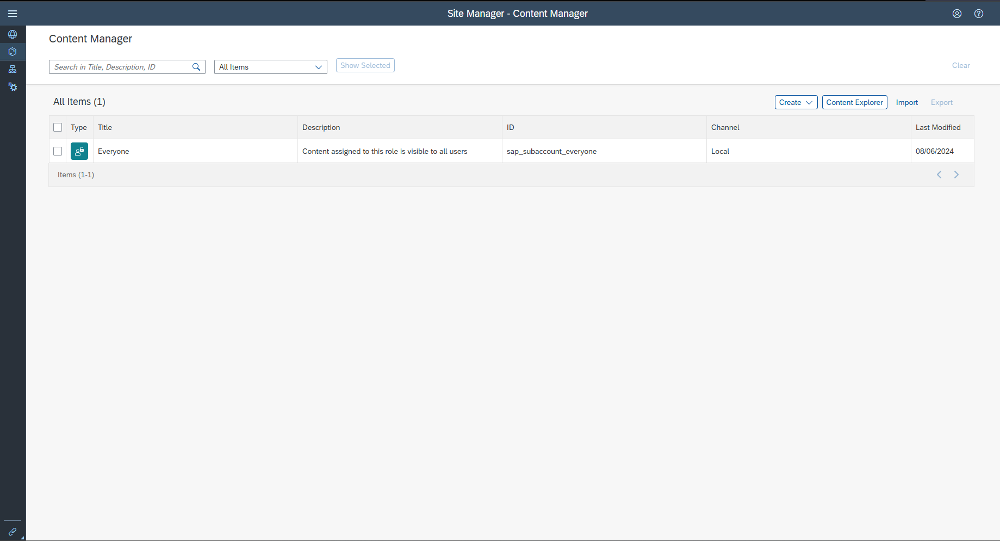
   
   Before Applying Theme:
   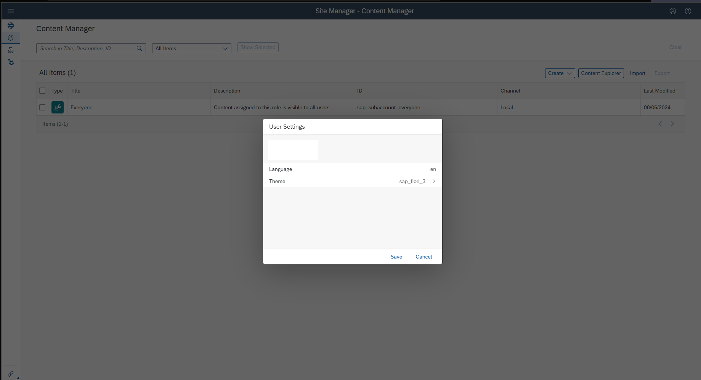

   After Applying Theme:
   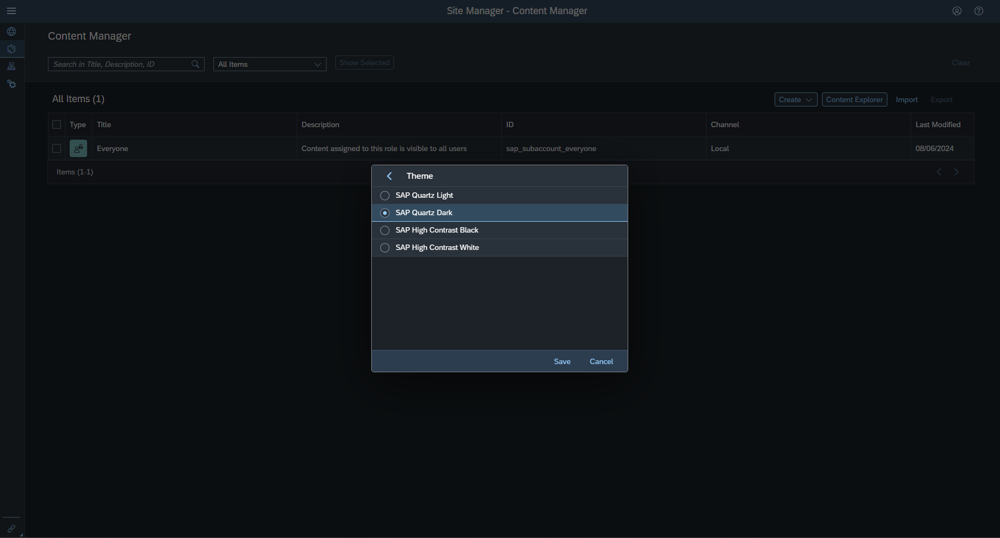

3. **Theme Designer (from v1.3):**
   - Open the Theme Designer.
   - Choose your desired theme from the extension popup.

   Before Applying Theme:
   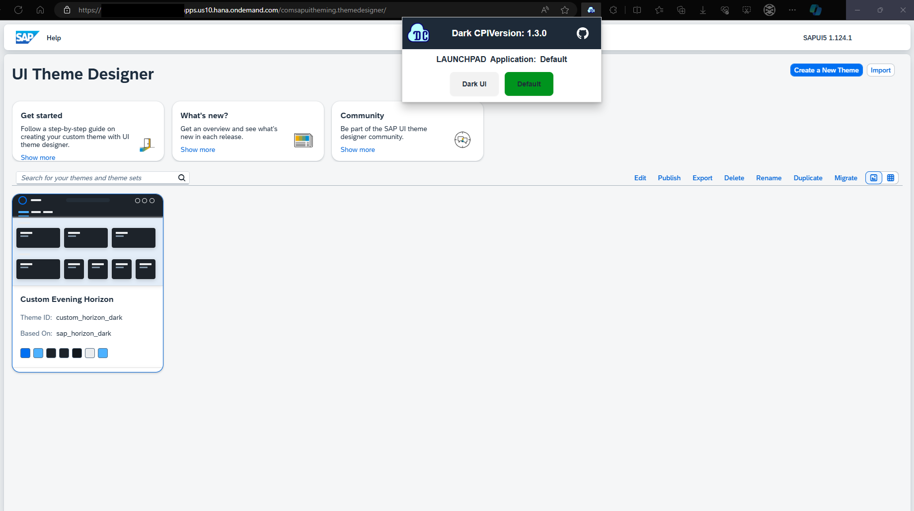

   After Applying Theme:
   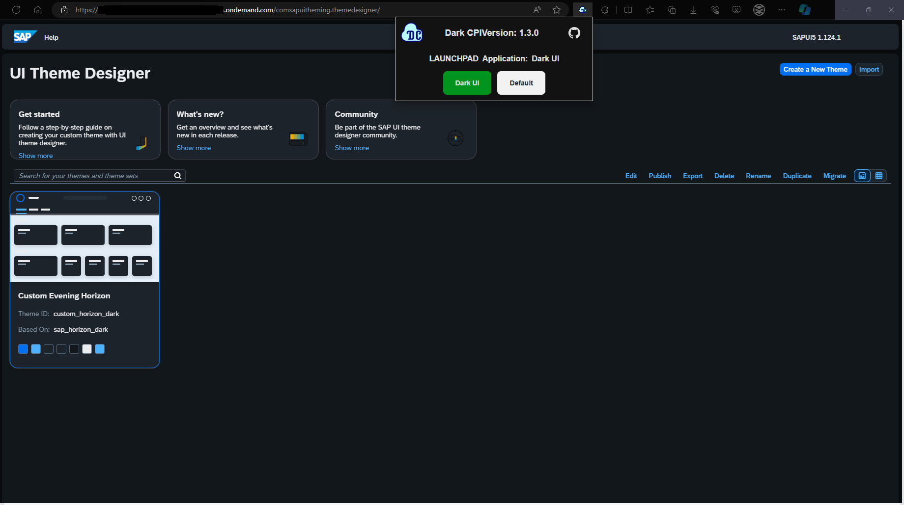

## Privacy and Transparency

The extension does not collect any personal data or tenant information, ensuring user privacy. Being open-source, users are encouraged to review the source code and monitor network activity for complete transparency.

## Troubleshooting Tips

- **Theme Not Applying:** Ensure the extension is enabled and you have selected the theme from the extension popup.
- **Visual Bugs:** Report any issues on the [GitHub repository](https://github.com/incpi/Dark-CPI-Web-Extension/issues) for prompt assistance.

## Conclusion

Dark CPI is your go-to extension for enhancing and customizing the look and feel of your SAP applications. With its comprehensive features, it caters to all your needs from theme customization to fixing SAP UI issues automatically. Install Dark CPI today and transform your user experience.

For more detailed information, visit the [Dark CPI GitHub Repository](https://github.com/incpi/Dark-CPI-Web-Extension).
